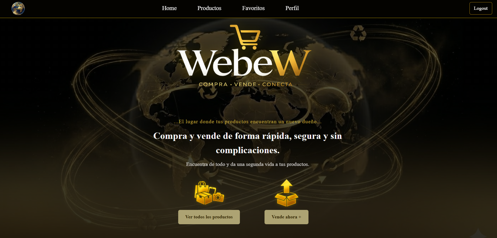
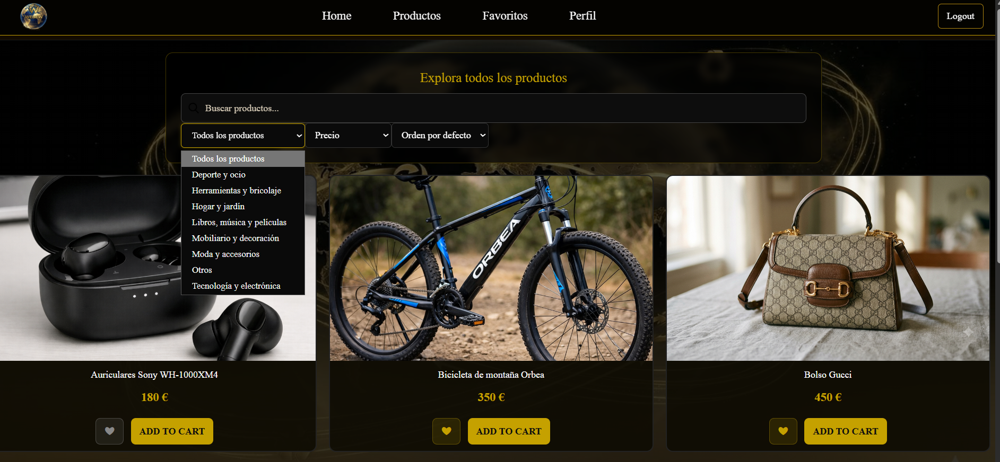
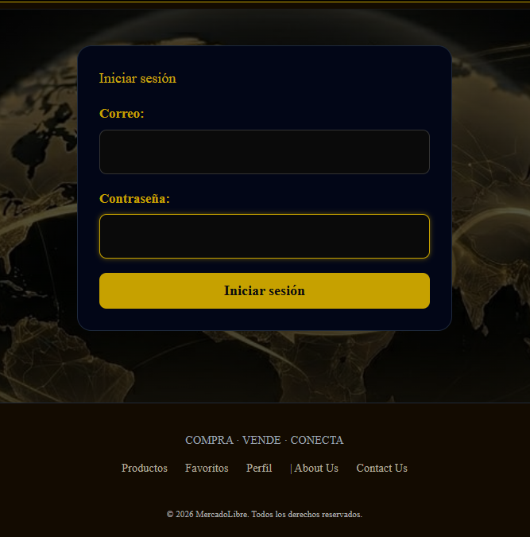
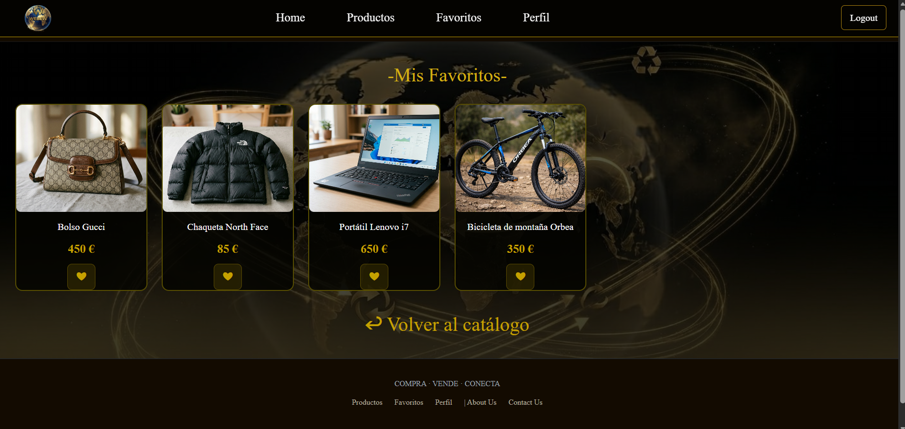
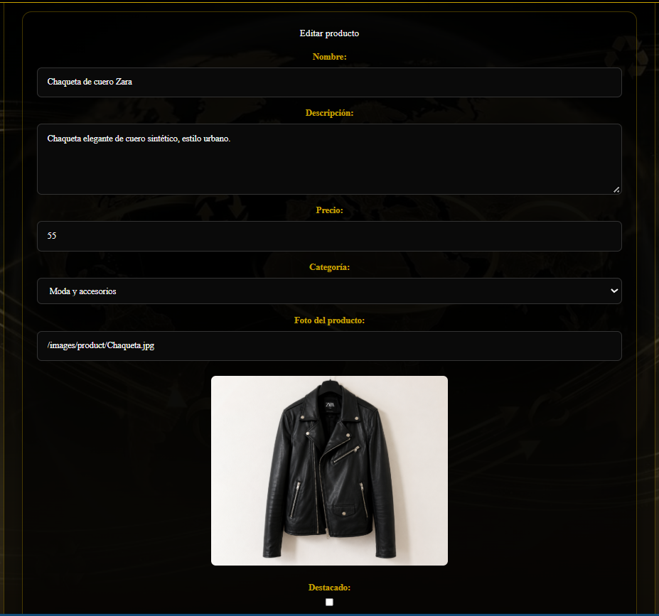

# 🛍️ Webew — Frontend ( Proyecto Full Stack )


Aplicación web del marketplace **Webew**, donde los usuarios pueden explorar, buscar y gestionar productos: catálogo, búsqueda en tiempo real, favoritos y un panel de administración para el CRUD de productos.

🔗 **App en producción:** [https://frontend-proyecto-final-sergio.onrender.com](https://frontend-proyecto-final-sergio.onrender.com)
🔗 **API (backend):** [https://backend-proyecto-final-sergio.onrender.com](https://backend-proyecto-final-sergio.onrender.com) — [repo Webew-backend](https://github.com/SergioPerez3/Webew-backend)

---

## ✨ Características

- Listado de productos con búsqueda en tiempo real y filtros por categoría
- Ordenación por precio, nombre o categoría, y paginación
- Vista de detalle de producto y productos destacados
- Gestión de favoritos por usuario, persistida en la base de datos
- Registro e inicio de sesión con JWT, rutas protegidas
- **Panel de administración**: crear, editar y eliminar productos
- Contexts globales para autenticación y favoritos
- Diseño responsive
- Tests con Vitest y Testing Library

## 🛠 Tecnologías utilizadas

- React + Vite
- React Router DOM
- Context API
- Tailwind CSS (parcial) + CSS
- Fetch / Axios para consumir la API
- Vitest + Testing Library

## 📁 Estructura del proyecto

```
frontend-proyecto-final-sergio/
├── public/
│   └── images/
│       └── products/
│           └── default.jpg
├── src/
│   ├── assets/
│   ├── components/
│   │   ├── FavoriteButton.jsx
│   │   ├── Footer.jsx
│   │   ├── Header.jsx
│   │   ├── Navbar.jsx / Navbar.css
│   │   ├── ProductCard.jsx
│   │   ├── ProductCarousel.jsx
│   │   ├── ProductFilters.jsx
│   │   ├── ProductForm.jsx
│   │   └── ProductList.jsx
│   ├── context/
│   │   ├── AuthContext.jsx
│   │   └── FavoritesContext.jsx
│   ├── hooks/
│   │   └── useAuth.js
│   ├── layouts/
│   │   ├── AdminLayout.jsx
│   │   └── MainLayout.jsx
│   ├── loaders/
│   │   └── authLoader.js
│   ├── pages/
│   │   ├── admin/
│   │   │   ├── AdminProductPage.jsx
│   │   │   └── DashboardPage.jsx
│   │   ├── AboutUs.jsx
│   │   ├── ContactUs.jsx
│   │   ├── FavoritesPage.jsx
│   │   ├── Home.jsx
│   │   ├── LoginPage.jsx
│   │   ├── NotFoundPage.jsx
│   │   ├── ProductDetailPage.jsx
│   │   ├── ProductsPage.jsx
│   │   └── RegisterPage.jsx
│   ├── routes/
│   │   └── router.jsx
│   ├── services/
│   │   ├── authService.js
│   │   ├── favoriteService.js
│   │   └── productService.js
│   ├── tests/
│   ├── App.jsx
│   ├── index.css
│   ├── main.jsx
│   └── setupTests.jsx
├── .env-example
├── .gitignore
├── eslint.config.js
├── index.html
├── package.json
├── package-lock.json
└── vite.config.js
```

## ⚙️ Instalación

1. Clona el repositorio:
   ```bash
   git clone <repository_url>
   cd frontend-proyecto-final-sergio
   ```

2. Instala las dependencias:
   ```bash
   npm install
   ```

3. Crea un archivo `.env` usando `.env-example` como referencia:
   ```env
   VITE_API_URL=http://localhost:3000/api
   ```
   En producción:
   ```env
   VITE_API_URL=https://backend-proyecto-final-sergio.onrender.com/api
   ```

## ▶️ Uso

```bash
npm run dev      # desarrollo → http://localhost:5173
npm test         # tests
npm run build    # build de producción → carpeta dist/
```

---

## 🔐 Autenticación

La aplicación utiliza JWT. Al iniciar sesión se guardan en `localStorage`:

```txt
token
user
```

Las rutas protegidas requieren autenticación para acceder al panel de administración, favoritos y la creación/edición de productos.

## ⭐ Favoritos

- Los usuarios autenticados pueden añadir productos a favoritos.
- Los favoritos se guardan en la base de datos y se muestran en una página dedicada.
- Se pueden eliminar productos individuales o vaciar todos los favoritos.

---

## 📸 Capturas

| Inicio | Catálogo y filtros | Login |
|---|---|---|
|  |  |  |

| Favoritos | Panel admin — editar producto |
|---|---|
|  |  |

## 🔮 Roadmap

- [ ] Carrito de compras (próximamente, junto con el backend)

## 👤 Autor

**Sergio Pérez Pérez** — Proyecto desarrollado como práctica final del curso Full Stack de Neoland.

